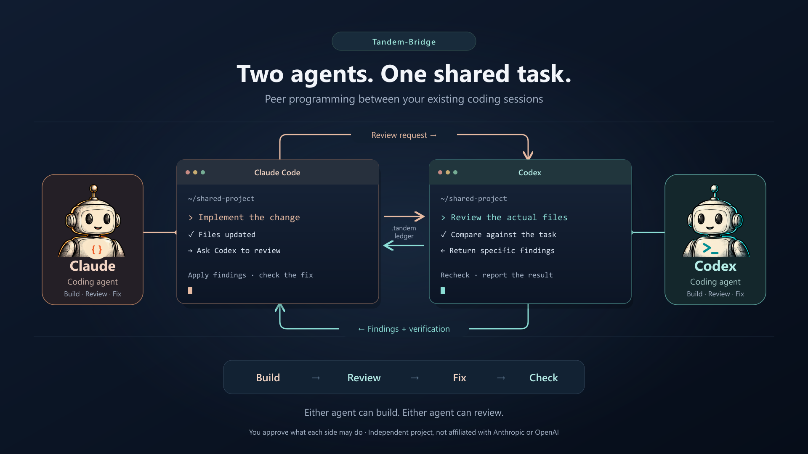
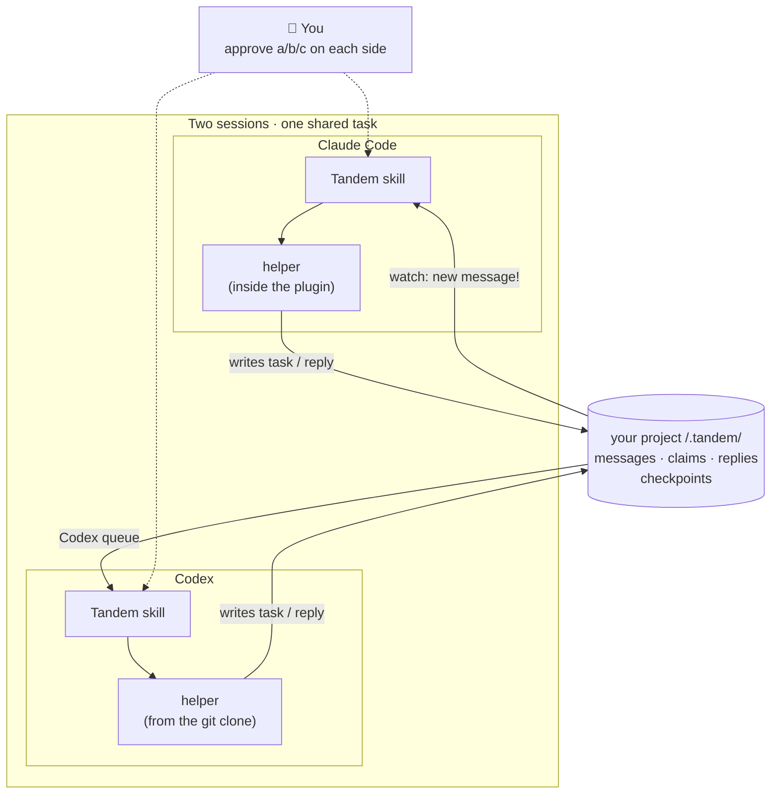
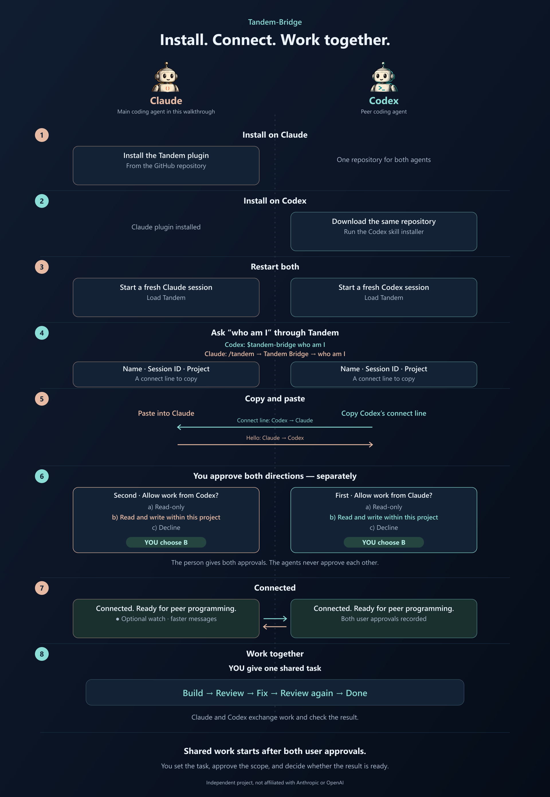

# Tandem bridge



Tandem lets a Claude session and a Codex session work together on one task,
with you in charge of what each one may do.

> **One shared task:** Claude Code ↔ Codex
>
> **The loop:** build → review → fix → done
>
> **Your role:** approve what each side may do

## Why use it?

- Get a second opinion from a different company's model. One agent builds;
  the other can find a problem the first missed.
- Keep a record of each request and reply inside your project, so you can
  see what was asked, answered, and still needs review.
- Stay in charge. You choose what each session may read or edit, and requests
  outside that choice come back to you.

## How it works



Each agent has its own copy of Tandem's helper, so install them in any order,
but keep both on the same version. They never talk directly: every task and
reply is written into a folder in your project, which is your record, and each
side is told when something new arrives for it. You approve what each side
may accept.

## What you need

- Claude Code and a Codex CLI or desktop app session.
- Python 3.10 or newer. macOS may offer Python 3.9 as `python3`; the skill
  checks for a newer interpreter before using the helper.
- Both sessions working in the same project folder for the easiest start.

Tandem runs from Python source. It has no runtime Python packages to install
and no Tandem executable.

## Install

### Claude Code

In Claude Code, add the public marketplace and install the plugin:

```text
claude plugin marketplace add BilalKarimbath/tandem-bridge
claude plugin install tandem-bridge@tandem-bridge
```

The plugin includes Claude's skill and a copy of the helper.

### Codex

Clone the repo once, then preview and install the Codex skill from it:

```text
git clone https://github.com/BilalKarimbath/tandem-bridge
cd tandem-bridge
python3 install_codex_skill.py --print
python3 install_codex_skill.py
```

Use a Python 3.10+ command in place of `python3` if needed (`py -3` on
Windows). The preview shows the skill before installation. If you already
have a different copy, the installer refuses to replace it; review and back
it up first. See [INSTALL.md](INSTALL.md) for those steps and updates.

Install both parts in any order. Claude has a helper inside its plugin; Codex
uses the helper in the clone. Check `python tandem.py version` from each
helper's folder to confirm the same version number. `claude plugin list` also
shows Claude's plugin version. Then restart Claude Code and open a new Codex
thread so both load their skills.

## Connect: the important part



1. **Ask “who am I?” through Tandem.** In Codex, type
   `$tandem-bridge who am I`. In Claude Code, type `/tandem`, choose
   **Tandem Bridge** from the menu, then ask `who am I`. You can do this in
   both sessions. A plain `who am I?` usually works too, but invoking the
   skill makes sure Tandem answers. Codex then gives you its session name,
   ID, project, ledger, and a connect command in this format:

   ```text
   This Codex session is named my-app-review.
   Session ID: <session-id>
   Project: my-app
   Ledger: <project>/.tandem/state
   To connect another session, paste this into it: tandem: connect to codex <session-id> on my-app (ledger <project>/.tandem/state)
   ```

2. **Copy the command at the end of the last line**, starting with
   `tandem: connect to`, and paste it as your message in the *other* session.
   In this example, paste it into the Claude session you will mainly work in.
   The connect command is the whole message; you do not need to add anything.
   Claude sends a hello to that exact Codex session.

3. **Choose what each side may accept.** Codex received the hello, so Codex
   asks first. Its menu offers:

   ```text
   - a) approve read-only reviews and status
   - b) approve read-only work and edits inside this project
   - c) decline
   ```

   Type `b` in Codex for this example. Claude then asks the same question for
   requests coming back from Codex. Type `b` there too. You can choose `a`
   for read-only work or `c` to decline instead.

4. **Look for “Connected.”** Once both sides have answered, the ready line
   names the peer and ends “Ready for peer programming. What is the task?” Go to
   [Your first task](#your-first-task) below.

You approve twice because each session decides what requests it will accept
from the other. A hello alone grants no work.

## Your first task

In the Claude session, try this in a small project:

> Add a `slugify` function and tests. Have Codex review your change. Fix its
> findings and repeat until the tests pass, up to three review rounds. Show
> me anything unresolved.

Tandem keeps both existing sessions on that task. The pair can build, review,
and fix in several turns; you can see each step.

## Everyday use

| Say to an agent | What it does |
| --- | --- |
| “tandem checkpoint” | Runs `checkpoint` to save a short note when a shared task ends. |
| “recap” in a new session | Runs `recap`, then checks the note against today's files. |
| “what's pending in Tandem?” | Runs `summary --open` to show work awaiting a claim, reply, or review. |
| “show sessions” | Shows the session directory with `discover --format markdown`. |

A sent message is not proof that the other session received it; its claim is
the receipt.

These notes and the message record stay in your project's `.tandem/` folder.
Keep that folder out of Git unless you deliberately choose otherwise.

## What stays with you

Tandem asks separately before work outside the project, deletions or renames,
handling secrets, or passing your material to a third session. A request from
the other agent is never your approval. Your agent's own runtime approval
prompts still apply.

## Troubleshooting

| What you see | What to do |
| --- | --- |
| macOS `python3` is 3.9 | Use Python 3.10+; the skill looks for a newer installed interpreter. |
| Codex says the Python helper is “not found” although it exists | Approve that exact interpreter and helper command once when the sandbox asks. |
| A reply has not appeared | In the session waiting for it, ask “what's pending in Tandem?” (`summary --open`). If its watch stopped, restart `watch --follow`. Check `status <id> --brief` for the claim and reply. Never resend an uncertain message. |
| The same Claude conversation is open in two windows | Close one window before connecting or claiming work. |
| Codex on Windows flashes console windows | This can come from its shared daemon; `codex --no-daemon` is a temporary workaround. |

## Tandem or `codex exec`?

| Your need | Use |
| --- | --- |
| One quick, independent question | Ask your agent directly, or use `codex exec` for a separate run. |
| Two live sessions building and reviewing one task over time | Use Tandem. |

## More detail

Tandem is an independent project, not affiliated with Anthropic or OpenAI.

Tandem is licensed under [Apache-2.0](LICENSE); see [NOTICE](NOTICE) for
attribution. Read [INSTALL.md](INSTALL.md) for setup and
[the detailed reference](docs/REFERENCE.md) for commands, limits, and recovery.
